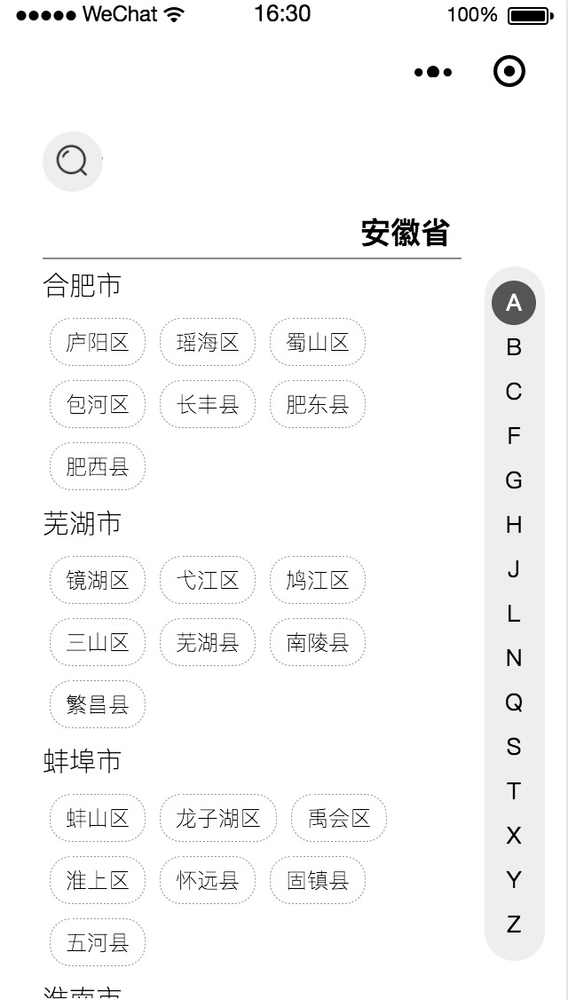
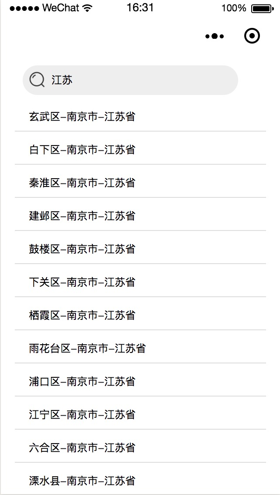
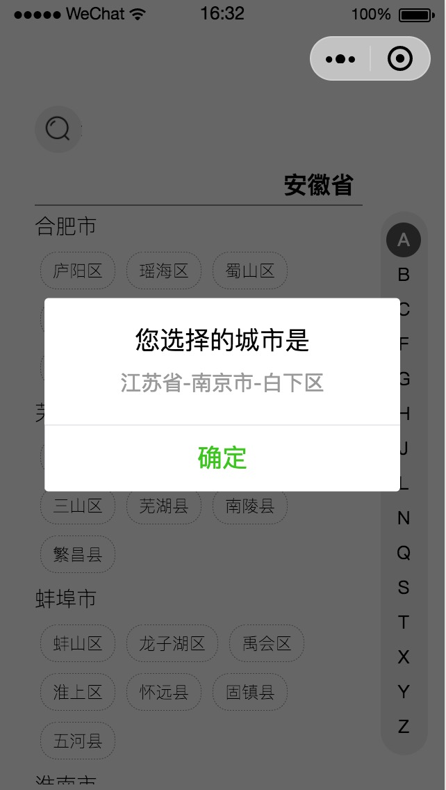

##  如何查看demo

### 1.直接使用开发者打包文件：
####  下载dist文件夹，用微信开发工具打开

### 2.自行编译
```console
  npm install
``` 
```console
  npm run build
``` 
####  然后将dist文件夹用微信开发工具打开


### 效果展示





### 特别说明

#### 目前还存在左侧滚动关联右侧导航同步不稳定问题（待优化）
#### 为了更好的显示效果，app设置navigationStyle: 'custom'  如需使用系统默认导航栏。需修改icityer的样式。后期会更新支持更多样式

### 参数

#### show
#### Boolean
#### 默认true

### 方法

#### choose
#### 返回Object 包含{province,city,area}

